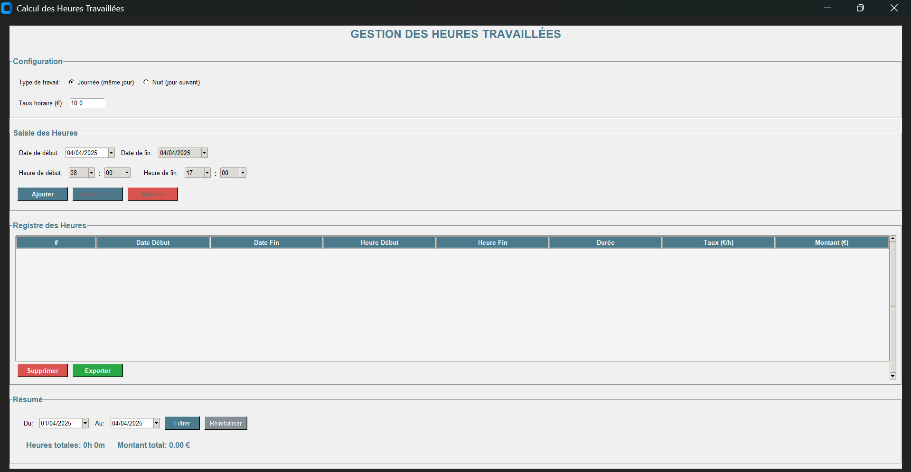

# Gestion des Heures Travaillées

Application complète pour gérer et calculer les heures travaillées, avec support pour le travail de jour et de nuit, calcul automatique des tarifs et diverses options d'exportation.



## Fonctionnalités

- **Types de travail**
  - Mode jour (même date de début et de fin)
  - Mode nuit (date de fin = date de début + 1 jour)

- **Calcul automatique**
  - Durée du travail (heures et minutes)
  - Montant total basé sur le taux horaire

- **Interface utilisateur intuitive**
  - Sélecteurs de date avec calendrier en français
  - Menus déroulants pour les heures/minutes
  - Tableau détaillé avec ligne de total
  - Interface adaptée aux conventions françaises

- **Gestion des données**
  - Ajout, modification et suppression d'entrées
  - Filtrage par plage de dates

- **Options d'exportation**
  - Format Excel (.xlsx)
  - Format PDF (.pdf)
  - Format image (.png)

## Installation

### Prérequis

L'application nécessite Python 3.6 ou supérieur et plusieurs bibliothèques externes.

```bash
# Installer les dépendances requises
pip install tkcalendar pandas pillow reportlab customtkinter
```

### Cloner le dépôt

```bash
git clone https://github.com/votre-username/gestion-heures-travaillees.git
cd gestion-heures-travaillees
```

### Exécution

```bash
python app.py
```

## Guide d'utilisation

### Configuration

1. Choisissez le type de travail (Journée ou Nuit)
2. Définissez le taux horaire en euros

### Ajout d'une entrée

1. Sélectionnez la date de début
2. Pour le travail de nuit, la date de fin sera automatiquement le jour suivant
3. Entrez l'heure de début et l'heure de fin
4. Cliquez sur "Ajouter"

### Modification d'une entrée

1. Double-cliquez sur une entrée existante dans le tableau
2. Modifiez les valeurs selon vos besoins
3. Cliquez sur "Mettre à jour" pour sauvegarder les modifications ou "Annuler" pour revenir en arrière

### Filtrage des données

1. Dans la section "Résumé", utilisez les champs "Du" et "Au" pour définir une plage de dates
2. Cliquez sur "Filtrer" pour afficher uniquement les entrées correspondantes
3. Cliquez sur "Réinitialiser" pour afficher toutes les entrées

### Exportation des données

1. Cliquez sur le bouton "Exporter"
2. Choisissez le format d'exportation souhaité :
   - Excel (.xlsx) - Pour les analyses et calculs
   - PDF (.pdf) - Pour l'impression et le partage formel
   - Image (.png) - Pour un aperçu rapide
3. Sélectionnez l'emplacement où sauvegarder le fichier

## Structure du code

L'application est organisée autour d'une classe principale `WorkHoursApp` qui gère l'interface utilisateur et la logique métier.

Principales sections :
- **Interface utilisateur** : Création et disposition des widgets
- **Gestion des données** : Ajout, modification et suppression d'entrées
- **Calculs** : Détermination des heures travaillées et des montants
- **Exportation** : Génération de fichiers Excel, PDF et images

## Personnalisation

### Interface utilisateur

L'application utilise `customtkinter` pour une interface moderne, mais fonctionne également avec Tkinter standard si `customtkinter` n'est pas disponible.

### Localisation

L'application est configurée pour l'affichage des dates en français. La localisation peut être modifiée en ajustant les paramètres suivants :

```python
# Pour changer la locale
locale.setlocale(locale.LC_TIME, 'en_US.UTF-8')  # Exemple pour l'anglais

# Pour les widgets DateEntry
self.start_date_entry = DateEntry(..., locale='en_US', date_pattern='mm/dd/yyyy')
```

## Dépannage

### Problèmes courants

1. **Erreur "No module named X"** : Installez les dépendances manquantes avec pip.
2. **Locale non disponible** : Assurez-vous que les locales sont correctement installées sur votre système.
3. **Erreur d'exportation** : Vérifiez que les permissions d'écriture sont correctement configurées pour le dossier de destination.

### Support

Pour tout problème ou suggestion, veuillez ouvrir une issue sur le dépôt GitHub.

## Contribution

Les contributions sont les bienvenues ! N'hésitez pas à proposer des améliorations via des pull requests.

1. Forkez le projet
2. Créez votre branche de fonctionnalité (`git checkout -b feature/nouvelle-fonctionnalite`)
3. Committez vos changements (`git commit -m 'Ajout d'une nouvelle fonctionnalité'`)
4. Pushez votre branche (`git push origin feature/nouvelle-fonctionnalite`)
5. Ouvrez une Pull Request

## Licence

Ce projet est sous licence MIT. Voir le fichier [LICENSE](LICENSE) pour plus de détails.

## Auteur

Boussad AIT DJOUDI OUFELLA - Développeur initial

---

**Note** : Cette application est conçue spécifiquement pour le calcul des heures travaillées et n'est pas destinée à remplacer les logiciels professionnels de gestion de paie ou de ressources humaines.
